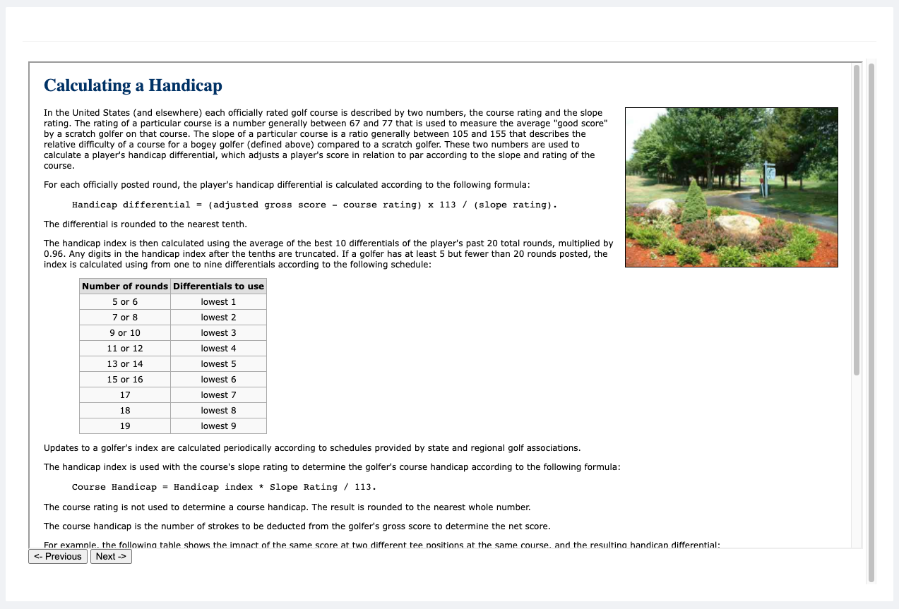

# Scorm
[](https://escolalms.github.io/Scorm/)
[](https://codecov.io/gh/EscolaLMS/Scorm)
[](https://github.com/EscolaLMS/Scorm/actions/workflows/test.yml)
[](https://packagist.org/packages/escolalms/scorm)
[](https://packagist.org/packages/escolalms/scorm)
[](https://packagist.org/packages/escolalms/scorm)

## What does it do
This package is used to store and manage SCORM packages.

## Installing
- `composer require escolalms/scorm`
- `php artisan migrate`
- `php artisan db:seed --class="EscolaLms\Scorm\Database\Seeders\DatabseSeeder"`
- `php artisan db:seed --class="EscolaLms\Scorm\Database\Seeders\PermissionTableSeeder"`


## Database
1. `scorm` - Scorm package main data.
2. `scorm_sco` - Educational content data associated with the Scorm package.
3. `scorm_sco_tracking` - Stores the user's progress.
```
Scorm 1 -> n ScormScos
Scorm 1 -> n ScormScoTracking
```

## Tutorial
1. Get the Scorm package from [EscolaLms\Scorm](https://github.com/EscolaLMS/Scorm/tree/main/database/mocks) or [Sample SCORM packages](https://scorm.com/scorm-explained/technical-scorm/golf-examples/?utm_source=google&utm_medium=natural_search).
2. Upload Scorm package in Zip format `/api/admin/scorm/upload`.
3. Start the player by specifying uuid Scorm SCO `/api/scorm/play/{uuid}`.
4. The package supports tracking user progress, to achieve this, you need to send an authorization token in the header.

## Endpoints
- `/api/admin/scorm/upload` - Upload ZIP Scorm Package into app local storage.
- `/api/scorm/play/{uuid}` - SCORM SCO player.

All the endpoints are defined in swagger [](https://escolalms.github.io/Scorm/)


## Tests
Run `./vendor/bin/phpunit` to run tests. See [tests](https://github.com/EscolaLMS/Scorm/tree/main/tests) folder as it's quite good staring point as documentation appendix.

Test details 
[](https://codecov.io/gh/EscolaLMS/scorm)
[](https://github.com/EscolaLMS/scorm/actions/workflows/test.yml)


## How to use this on frontend.
Endpoint `/api/scorm/play/{uuid}` returns the html file with the `<iframe>`.

```html
<html lang="en">
...
<iframe src="api/storage/{scorm-version}/{uuid}/index.html"></iframe>
...
</html>
```

### Admin panel
**List of Scorm packages**


**Scorm player**


## Permissions
Permissions are defined in [seeder](database/seeders/PermissionTableSeeder.php).

## Todo.
The package does not support all available scorm formats 
[#1](https://github.com/EscolaLMS/Scorm/issues/13)
[#2](https://github.com/EscolaLMS/Scorm/issues/6)
